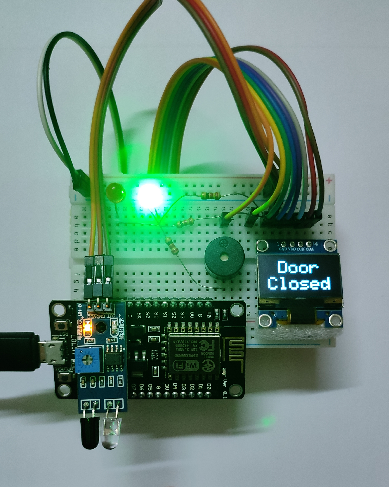
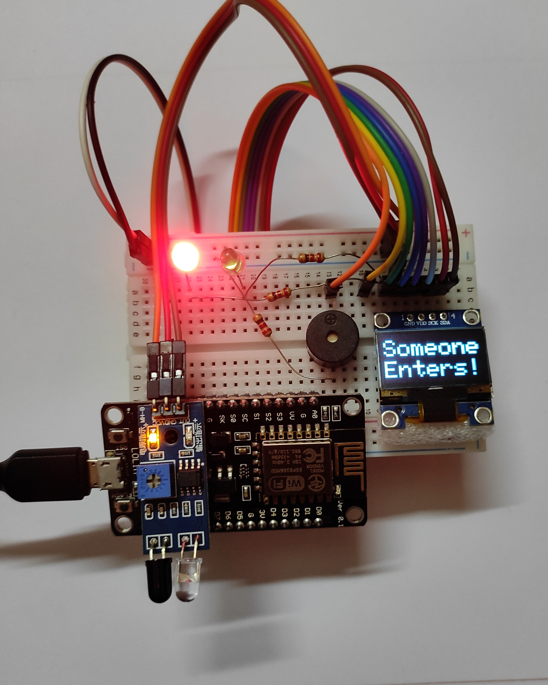
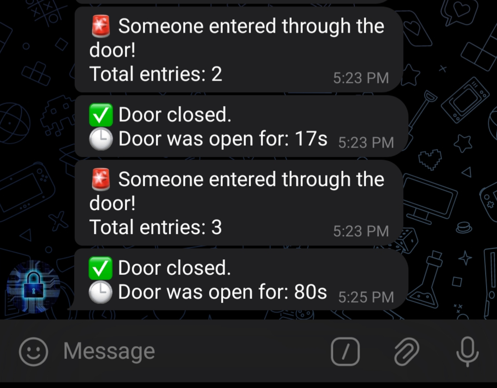
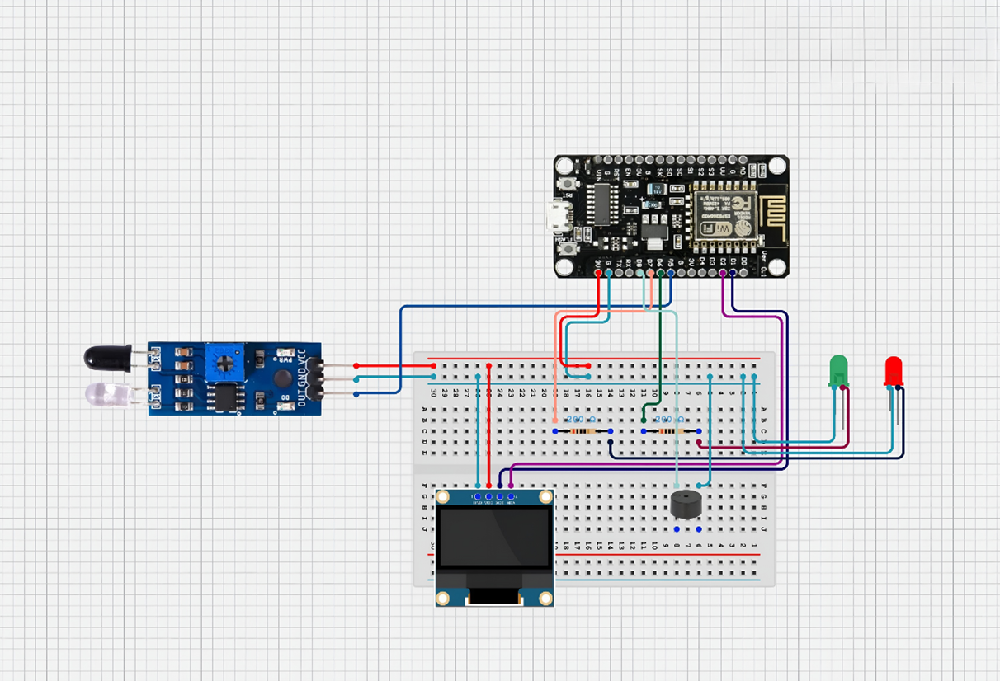

# NodeMCU IR-Based IoT Door Security System 🚪🔒

This project is an IoT-based door security system developed using a NodeMCU ESP8266.
The system relies on an infrared (IR) sensor to detect whether the door is open or closed. Based on the detection, it provides multiple responses:
- <b>LED indicators:</b> Red LED when the door is closed, Green LED when the door is open.
- <b>Buzzer alarm:</b> Optional alert when the door is opened.
- <b>OLED display animations:</b> After a short delay, the screen shows door open/close graphics for better visualization.

<p align="center">
  
</p>

Beyond local alerts, the system connects to the internet to provide real time notifications through Telegram. This allows you to monitor the door status remotely on your smartphone.
For network setup, the project uses WiFiManager, which eliminates the need to hardcode Wi-Fi credentials.

Instead, you can easily connect to a temporary access point created by the NodeMCU and configure your Wi-Fi details through a simple web page.
This makes the system practical, flexible, and easy to deploy in different environments

## ✨ Features

- 👁️ Detects door open/closed status with IR sensor
- 🔴🟢 LEDs for instant visual indication
- 🔔 Buzzer alarm for warnings or alerts
- 📺 OLED animations for door status (open/closed)
- 📱 Telegram notifications for remote monitoring
- 🌐 WiFiManager for quick and user-friendly Wi-Fi setup

## 🌟 Highlights

- 🎨 OLED Animation Support: Door open/closed status shown with a short delay.
- 📡 Telegram Integration: Get instant updates on your phone, from anywhere in the world as long as the device is connected to the internet.
- 🛠️ Configurable Wi-Fi: Change credentials anytime via web portal.
- 🔒 Simple & Effective: Combines sensing, display, and IoT alerts in one compact system.

## 🛠️ Components Used

- NodeMCU ESP8266
- IR Sensor
- Resistors (220 ohm)
- Red LED + Green LED
- Buzzer
- OLED Display (SSD1306)
- Breadboard & jumper wires

## 📷Images & Screenshots
- Door open/close scenario

<p align="center">
  
  &nbsp;
  
</p>

- Wifi Portal:

<p align="center">
  
  &nbsp;
  
</p>

- Telegram Notification:

<p align="center">
  
</p>

## Components Connection Diagram

<p align="center">
  
</p>

## 🔌 Components Connection Chart

<p align="center">
  
</p>

## 🚀 Setup & Run

- Download or Clone the repository
```
git clone https://github.com/yourusername/nodemcu-door-security-system.git

```

- Install required Arduino libraries:
```
Adafruit_SSD1306
Adafruit_GFX
WiFiManager
UniversalTelegramBot
```
- Set up your Telegram Bot
  - Create a bot using @BotFather
  - Get the bot token and chat ID.
  - Add them in the code.
- Connect to WiFiManager portal (NodeMCU starts in AP mode if no saved Wi-Fi).
  - Open the portal in your browser.
  - Enter your Wi-Fi SSID and password.
- Upload the code to the NodeMCU board.
- Run the system. It will now monitor and notify door activity.

## 🖱️ Usage

- Door Closed → Red LED ON, OLED shows closed animation, Telegram sends Door Closed message.
- Door Opened → Green LED ON, buzzer alert, OLED shows open animation, Telegram sends Door Opened message.
- Wi-Fi Lost → NodeMCU creates its own hotspot; reconnect via WiFiManager to update credentials.
